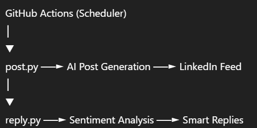
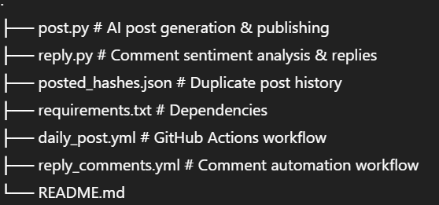

# 🚀 LinkedIn AI Automation Suite


An **AI-powered LinkedIn automation system** that creates, publishes, and engages with content automatically using Large Language Models and LinkedIn APIs.

Built for **developers, creators, and professionals** who want consistent personal branding with zero daily effort.

---

## ✨ What This Project Does

- 🧠 Generates **high-engagement AI & CS LinkedIn posts**
- 🔁 Prevents duplicate content using hashing
- 🖼️ Uploads images with posts
- 💬 Analyzes and replies to comments using **sentiment-aware AI**
- ⏰ Runs fully automated using **GitHub Actions**

---

## 🧠 System Architecture



---

## 📁 Project Structure



---

## ⚙️ Environment Variables

```bash
GROQ_API_KEY=your_groq_api_key
LINKEDIN_ACCESS_TOKEN=your_linkedin_token
LINKEDIN_PERSON_URN=urn:li:person:xxxxxxxx

⚠️ Keep these values in GitHub Secrets. Never commit them.

---

## 🛠️ Installation (Local)

git clone https://github.com/yourusername/linkedin-ai-automation.git
cd linkedin-ai-automation
pip install -r requirements.txt
python post.py

---

⏰ Automation

daily_post.yml → Posts daily AI/CS content

reply_comments.yml → Replies to comments intelligently

Runs completely unattended once configured.

---

🔒 Safety & Ethics

Duplicate protection

Rate-limit friendly

Toxic comment filtering

Professional tone enforcement

---

🚀 Future Enhancements

Analytics dashboard

Carousel posts

Multi-account support

Approval-based posting mode

---

👤 Author

Sulekh Niwal
AI Automation • Backend Systems • Developer Productivity

⭐ Star the repo if you find this useful.